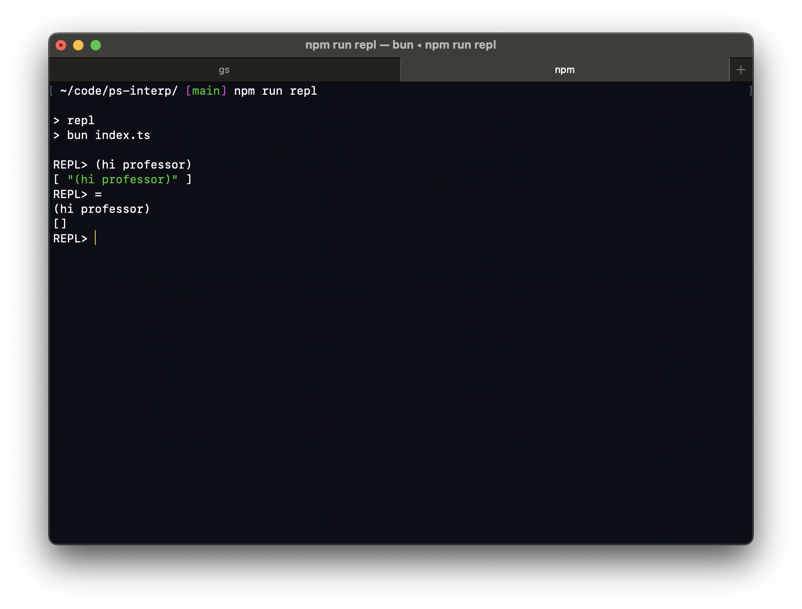
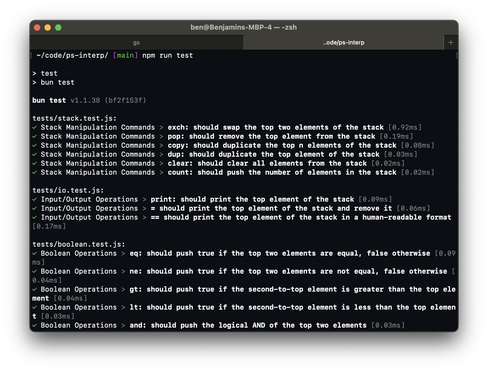

# ps-interp

## DEMO

[DEMO VIDEO CLICK HERE!!!](https://youtu.be/EvNyoWcXmrY)

## Images

### repl



### tests



## Commands

> Switch to Dynamic scoping

```bash
use-dynamic
```

> Switch to Static scoping

```bash
use-Static
```

## Where to start

1. Check that you have NPM installed.
2. Install dependencies
3. Run the repl
4. Optionally: run tests

### Requirements

npm >= v9.6.7

### Install Dependencies

```bash
npm i
```

### Run REPL

> Run w/ Dynamic Scoping

```bash
npm run repl
```

> Run w/ Static Scoping

```bash
npm run repl-static
```

### Run ALL tests

```bash
npm run test
```

This project was created using `bun init` in bun v1.0.28. [Bun](https://bun.sh) is a fast all-in-one JavaScript runtime.
